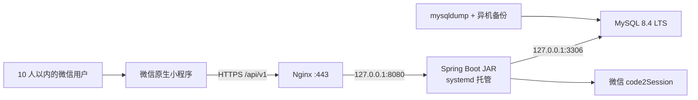

# 记账本微信小程序完整实现方案（10 人以内、单机原生部署）

> 版本：V1.0  
> 日期：2026-08-13  
> 目标：微信原生小程序 + Spring Boot + Nginx + MySQL，直接部署 Linux；不使用 Docker、Redis、微服务和消息队列。

## 1. 结论与实施边界

本项目采用一台 Linux 云主机完成生产部署：Nginx 对外提供 HTTPS，Spring Boot 以 JAR + systemd 运行，MySQL 以系统服务运行。服务器只开放 80、443 和受限来源的 22 端口；Spring Boot 的 8080 与 MySQL 的 3306 仅监听本机。

第一版做成“邀请制共享账本”，支持全系统最多 10 个有效用户。用户通过微信登录，首位管理员使用一次性初始化密钥创建系统和默认账本，其他人只能通过账本邀请链接加入。

第一版完整可用范围：

- 微信登录、退出、登录态续用。
- 多账本切换；每个账本最多 10 人。
- 账本所有者、管理员、成员三级权限。
- 邀请加入、移除成员、退出账本。
- 收入、支出新增、修改、软删除、分页与筛选。
- 分类、资金账户管理。
- 月度收支概览、趋势、分类占比、成员统计。
- CSV 导出。
- 操作审计、数据库备份、日志轮转、发布和回滚。
- 用户注销与数据处理。

第一版不做：票据图片/OCR、微信支付账单自动同步、银行同步、支付功能、多币种汇率、AI 分类、复杂预算、消息队列、后台管理站点。它们不影响当前架构，确有需求时再迭代。

## 2. 架构设计



组件职责：

| 组件 | 职责 | 不承担的职责 |
|---|---|---|
| 微信小程序 | 页面、交互、令牌保存、请求封装 | 不保存 AppSecret，不判断最终权限 |
| Nginx | TLS、反向代理、基础限流、请求大小限制 | 不处理业务数据 |
| Spring Boot | 登录、权限、业务、事务、审计、统计 | 不直接暴露公网端口 |
| MySQL | 业务数据、登录态、幂等键、邀请信息 | 不对公网开放 |
| systemd | 启停、自恢复、开机启动、日志接入 | 不构建应用 |

不使用 Redis 后的替代方式：

| 原常见用途 | 本项目方案 |
|---|---|
| 登录态 | `auth_session` 表保存令牌摘要 |
| 登录限流 | Nginx `limit_req`；关键接口再做数据库校验 |
| 防重复提交 | `client_request_id` 唯一索引 |
| 邀请码 | MySQL 保存邀请令牌摘要、次数和失效时间 |
| 缓存统计 | 10 人规模直接查询索引良好的 MySQL |
| 定时清理 | Spring `@Scheduled` 清理过期会话和邀请 |
| 分布式锁 | 单实例不需要；关键写入使用事务和行锁 |

## 3. 技术选型

| 层 | 选型 |
|---|---|
| 小程序 | 微信原生小程序、TypeScript、原生组件或 TDesign（二选一） |
| Java | JDK 21 LTS |
| 后端 | Spring Boot 4.1.x，Spring MVC、Validation、Security、Data JPA |
| 数据库迁移 | Flyway |
| 接口文档 | springdoc-openapi；仅开发/测试启用 |
| 数据库 | MySQL 8.4 LTS、InnoDB、utf8mb4 |
| 网关 | Nginx 系统包 |
| 构建 | Maven Wrapper，产物为可执行 JAR |
| 部署 | systemd + 版本化 JAR + current.jar 软链接 |
| 测试 | JUnit 5、Mockito、MockMvc；集成测试使用独立 MySQL 测试库 |

选择 Spring Data JPA 是为了减少第三方版本适配面；统计类复杂 SQL可使用 `JdbcClient` 或原生 SQL，不要求所有查询都通过实体关联完成。

## 4. 业务和权限规则

### 4.1 封闭注册与 10 人上限

1. 数据库初始化后系统状态为 `initialized=false`。
2. 首位用户调用微信登录时必须同时提交服务器配置的 `bootstrapKey`。
3. 后端完成 `code2Session` 后，在事务内锁定 `app_config` 行，创建首位用户、默认账本和 OWNER 成员记录，然后置 `initialized=true`。
4. 以后从未注册过的微信用户必须携带有效邀请令牌登录，否则返回 `INVITE_REQUIRED`，并且不创建垃圾用户记录。
5. 新用户注册时锁定 `app_config` 行并再次计算有效用户数；达到 10 人返回 `USER_LIMIT_REACHED`。
6. 邀请加入也在同一事务内锁定邀请记录，校验到期时间、使用次数、账本人数和系统人数。

`bootstrapKey` 至少使用 20 位随机字符，首次初始化后从生产环境文件中删除并重启服务。

### 4.2 角色权限

| 操作 | OWNER | ADMIN | MEMBER |
|---|:---:|:---:|:---:|
| 查看账本、账单和统计 | ✓ | ✓ | ✓ |
| 新增账单 | ✓ | ✓ | ✓ |
| 修改/删除自己创建的账单 | ✓ | ✓ | ✓ |
| 修改/删除他人账单 | ✓ | ✓ | 默认不允许 |
| 管理分类、账户 | ✓ | ✓ | 只读 |
| 创建/撤销邀请 | ✓ | ✓ | × |
| 移除普通成员 | ✓ | ✓ | × |
| 调整管理员 | ✓ | × | × |
| 删除账本、转移所有权 | ✓ | × | × |

所有权限必须在后端校验。客户端隐藏按钮只改善交互，不构成安全控制。

### 4.3 账单规则

- 金额始终为正数，类型决定收入或支出；使用 `DECIMAL(15,2)`，严禁使用浮点数。
- 业务日期用 `DATE`；创建和更新时间用 `DATETIME(3)`，服务端统一按 `Asia/Shanghai` 解释。
- 账单必须属于一个账本、分类、账户和经手成员。
- 支出只能选择支出分类，收入只能选择收入分类。
- 删除采用软删除，统计和普通列表只查询 `deleted_at IS NULL`。
- 更新使用 `version` 乐观锁，版本冲突返回 HTTP 409，避免覆盖他人的修改。
- 新增请求必须携带客户端生成的 UUID `clientRequestId`；重复提交返回第一次创建的结果。
- 余额不保存冗余汇总值，按“期初余额 + 收入 - 支出”计算，避免缓存余额漂移。

## 5. 页面与交互

### 5.1 页面结构

```text
miniprogram/
├── pages/
│   ├── bootstrap/index       # 首次初始化/邀请提示
│   ├── home/index            # 本月概览、最近账单
│   ├── entry/list            # 账单列表与筛选
│   ├── entry/edit            # 新增/编辑账单
│   ├── statistics/index      # 趋势、分类、成员统计
│   ├── ledger/list           # 账本选择与创建
│   ├── ledger/settings       # 账本设置
│   ├── member/list           # 成员和邀请
│   ├── category/list         # 分类管理
│   ├── account/list          # 账户管理
│   └── profile/index         # 个人信息、导出、退出、注销
├── components/
│   ├── amount-input/
│   ├── entry-card/
│   ├── month-picker/
│   └── empty-state/
├── services/                 # API 函数
├── utils/                    # request、date、money
├── store/                    # 简单全局状态
├── types/
└── config/
```

底部 Tab 建议为：首页、明细、记一笔、统计、我的。新增按钮进入同一个编辑页，默认沿用上次选择的账本、类型、账户，但不沿用金额和备注。

### 5.2 小程序请求规范

- `Authorization: Bearer <opaque-token>`。
- `X-Request-Id: <UUID>` 用于日志追踪。
- 遇到 401 时只允许自动调用一次 `wx.login`，防止刷新死循环。
- 令牌使用 `wx.setStorageSync` 保存；退出或注销立即删除。
- 金额输入以字符串处理并校验最多两位小数，不在前端使用浮点运算生成最终金额。
- 接口地址分为 `dev`、`trial`、`release` 三套配置，正式版只指向 HTTPS 正式域名。
- 分享邀请使用小程序页面路径参数 `inviteCode`；页面先保存邀请令牌，再完成微信登录和接受邀请。

## 6. 后端工程设计

### 6.1 工程结构

```text
account-book-server/
├── pom.xml
├── mvnw
├── src/main/java/com/example/accountbook/
│   ├── AccountBookApplication.java
│   ├── common/               # 返回体、异常、分页、请求 ID
│   ├── config/               # Security、Jackson、JPA、定时任务
│   ├── auth/                 # 微信登录、会话、认证过滤器
│   ├── user/
│   ├── ledger/
│   ├── member/
│   ├── invite/
│   ├── category/
│   ├── account/
│   ├── entry/
│   ├── statistics/
│   ├── export/
│   └── audit/
├── src/main/resources/
│   ├── application.yml
│   ├── application-dev.yml
│   ├── application-prod.yml
│   └── db/migration/
│       ├── V1__init_schema.sql
│       └── V2__seed_app_config.sql
└── src/test/
```

按业务模块组织，而不是把所有 Controller、Service、Repository 分别堆在三个大目录中。实体不直接作为接口 DTO 返回。

### 6.2 关键依赖

```xml
<dependencies>
  <dependency>
    <groupId>org.springframework.boot</groupId>
    <artifactId>spring-boot-starter-web</artifactId>
  </dependency>
  <dependency>
    <groupId>org.springframework.boot</groupId>
    <artifactId>spring-boot-starter-validation</artifactId>
  </dependency>
  <dependency>
    <groupId>org.springframework.boot</groupId>
    <artifactId>spring-boot-starter-security</artifactId>
  </dependency>
  <dependency>
    <groupId>org.springframework.boot</groupId>
    <artifactId>spring-boot-starter-data-jpa</artifactId>
  </dependency>
  <dependency>
    <groupId>org.flywaydb</groupId>
    <artifactId>flyway-mysql</artifactId>
  </dependency>
  <dependency>
    <groupId>com.mysql</groupId>
    <artifactId>mysql-connector-j</artifactId>
    <scope>runtime</scope>
  </dependency>
  <dependency>
    <groupId>org.springframework.boot</groupId>
    <artifactId>spring-boot-starter-actuator</artifactId>
  </dependency>
  <dependency>
    <groupId>org.springframework.boot</groupId>
    <artifactId>spring-boot-starter-test</artifactId>
    <scope>test</scope>
  </dependency>
</dependencies>
```

版本统一交给 Spring Boot BOM 管理；不要给 Spring 自身依赖逐个手写版本号。

### 6.3 登录和会话

登录流程：

1. 小程序执行 `wx.login()` 获取一次性 `code`。
2. 调用 `POST /api/v1/auth/wechat-login`，可附带 `inviteCode` 或首次初始化的 `bootstrapKey`。
3. 后端用 AppID、AppSecret 和 code 调微信 `code2Session`，获得 `openid` 和 `session_key`。
4. 后端只按 `openid` 识别用户；`session_key` 不下发、不写日志、不作为本系统登录令牌。
5. 后端生成 32 字节安全随机令牌，Base64URL 编码后返回；数据库只存其 SHA-256 十六进制摘要。
6. 每次请求由认证过滤器哈希 Bearer Token，查询未撤销且未到期的会话，并加载用户。
7. 会话有效期建议 30 天；每次微信登录撤销该设备旧会话并轮换新令牌。退出时立即撤销当前会话。

对 10 个用户而言，每个请求增加一次有索引的会话查询成本可以忽略，换来的是立即注销、强制下线和清晰审计。

### 6.4 统一响应

成功：

```json
{
  "code": "OK",
  "message": "success",
  "data": {},
  "requestId": "47b4e17a-5bc3-4a36-ae7f-9af15faf1072"
}
```

失败：

```json
{
  "code": "ENTRY_VERSION_CONFLICT",
  "message": "账单已被其他成员修改，请刷新后重试",
  "data": null,
  "requestId": "47b4e17a-5bc3-4a36-ae7f-9af15faf1072"
}
```

HTTP 状态码使用 200/201/204、400、401、403、404、409、429、500；业务码保持稳定，前端不得依赖中文 message 做分支判断。

## 7. 数据库设计

### 7.1 核心表

| 表 | 作用 |
|---|---|
| `app_config` | 单例配置、是否初始化、全系统人数上限 |
| `app_user` | 微信用户，openid 唯一 |
| `auth_session` | 可撤销的登录令牌摘要 |
| `ledger` | 账本 |
| `ledger_member` | 用户与账本关系及角色 |
| `ledger_invite` | 邀请令牌摘要、次数、期限 |
| `category` | 收入/支出分类 |
| `fund_account` | 现金、微信、银行卡等资金账户 |
| `book_entry` | 收入/支出明细 |
| `audit_log` | 关键操作审计 |

### 7.2 V1 建表 SQL

以下作为 Flyway `V1__init_schema.sql` 的基线；生产环境后续只增加新的迁移文件，不修改已经执行的 V1。

```sql
CREATE TABLE app_config (
    id              TINYINT UNSIGNED NOT NULL,
    initialized     BOOLEAN NOT NULL DEFAULT FALSE,
    max_users       TINYINT UNSIGNED NOT NULL DEFAULT 10,
    version         INT UNSIGNED NOT NULL DEFAULT 0,
    updated_at      DATETIME(3) NOT NULL DEFAULT CURRENT_TIMESTAMP(3)
                    ON UPDATE CURRENT_TIMESTAMP(3),
    PRIMARY KEY (id),
    CONSTRAINT ck_app_config_singleton CHECK (id = 1),
    CONSTRAINT ck_app_config_max_users CHECK (max_users BETWEEN 1 AND 10)
) ENGINE=InnoDB DEFAULT CHARSET=utf8mb4 COLLATE=utf8mb4_0900_ai_ci;

INSERT INTO app_config (id, initialized, max_users) VALUES (1, FALSE, 10);

CREATE TABLE app_user (
    id              BIGINT UNSIGNED NOT NULL AUTO_INCREMENT,
    openid          VARCHAR(64) NOT NULL,
    unionid         VARCHAR(64) NULL,
    nickname        VARCHAR(64) NOT NULL DEFAULT '微信用户',
    avatar_url      VARCHAR(512) NULL,
    status          VARCHAR(16) NOT NULL DEFAULT 'ACTIVE',
    last_login_at   DATETIME(3) NULL,
    created_at      DATETIME(3) NOT NULL DEFAULT CURRENT_TIMESTAMP(3),
    updated_at      DATETIME(3) NOT NULL DEFAULT CURRENT_TIMESTAMP(3)
                    ON UPDATE CURRENT_TIMESTAMP(3),
    version         INT UNSIGNED NOT NULL DEFAULT 0,
    PRIMARY KEY (id),
    UNIQUE KEY uk_app_user_openid (openid),
    KEY idx_app_user_unionid (unionid),
    KEY idx_app_user_status (status),
    CONSTRAINT ck_app_user_status CHECK (status IN ('ACTIVE','DISABLED','DELETED'))
) ENGINE=InnoDB DEFAULT CHARSET=utf8mb4 COLLATE=utf8mb4_0900_ai_ci;

CREATE TABLE auth_session (
    id              BIGINT UNSIGNED NOT NULL AUTO_INCREMENT,
    user_id         BIGINT UNSIGNED NOT NULL,
    token_hash      CHAR(64) CHARACTER SET ascii COLLATE ascii_bin NOT NULL,
    expires_at      DATETIME(3) NOT NULL,
    revoked_at      DATETIME(3) NULL,
    last_seen_at    DATETIME(3) NULL,
    created_at      DATETIME(3) NOT NULL DEFAULT CURRENT_TIMESTAMP(3),
    PRIMARY KEY (id),
    UNIQUE KEY uk_auth_session_token_hash (token_hash),
    KEY idx_auth_session_user (user_id, revoked_at),
    KEY idx_auth_session_expiry (expires_at),
    CONSTRAINT fk_auth_session_user FOREIGN KEY (user_id) REFERENCES app_user(id)
) ENGINE=InnoDB DEFAULT CHARSET=utf8mb4 COLLATE=utf8mb4_0900_ai_ci;

CREATE TABLE ledger (
    id              BIGINT UNSIGNED NOT NULL AUTO_INCREMENT,
    name            VARCHAR(64) NOT NULL,
    currency        CHAR(3) CHARACTER SET ascii NOT NULL DEFAULT 'CNY',
    timezone        VARCHAR(40) CHARACTER SET ascii NOT NULL DEFAULT 'Asia/Shanghai',
    owner_user_id   BIGINT UNSIGNED NOT NULL,
    max_members     TINYINT UNSIGNED NOT NULL DEFAULT 10,
    status          VARCHAR(16) NOT NULL DEFAULT 'ACTIVE',
    created_at      DATETIME(3) NOT NULL DEFAULT CURRENT_TIMESTAMP(3),
    updated_at      DATETIME(3) NOT NULL DEFAULT CURRENT_TIMESTAMP(3)
                    ON UPDATE CURRENT_TIMESTAMP(3),
    version         INT UNSIGNED NOT NULL DEFAULT 0,
    PRIMARY KEY (id),
    KEY idx_ledger_owner (owner_user_id),
    CONSTRAINT fk_ledger_owner FOREIGN KEY (owner_user_id) REFERENCES app_user(id),
    CONSTRAINT ck_ledger_max_members CHECK (max_members BETWEEN 1 AND 10),
    CONSTRAINT ck_ledger_status CHECK (status IN ('ACTIVE','ARCHIVED','DELETED'))
) ENGINE=InnoDB DEFAULT CHARSET=utf8mb4 COLLATE=utf8mb4_0900_ai_ci;

CREATE TABLE ledger_member (
    id              BIGINT UNSIGNED NOT NULL AUTO_INCREMENT,
    ledger_id       BIGINT UNSIGNED NOT NULL,
    user_id         BIGINT UNSIGNED NOT NULL,
    role            VARCHAR(16) NOT NULL DEFAULT 'MEMBER',
    display_name    VARCHAR(64) NULL,
    status          VARCHAR(16) NOT NULL DEFAULT 'ACTIVE',
    joined_at       DATETIME(3) NOT NULL DEFAULT CURRENT_TIMESTAMP(3),
    removed_at      DATETIME(3) NULL,
    PRIMARY KEY (id),
    UNIQUE KEY uk_ledger_member (ledger_id, user_id),
    KEY idx_member_user (user_id, status),
    CONSTRAINT fk_member_ledger FOREIGN KEY (ledger_id) REFERENCES ledger(id),
    CONSTRAINT fk_member_user FOREIGN KEY (user_id) REFERENCES app_user(id),
    CONSTRAINT ck_member_role CHECK (role IN ('OWNER','ADMIN','MEMBER')),
    CONSTRAINT ck_member_status CHECK (status IN ('ACTIVE','REMOVED','LEFT'))
) ENGINE=InnoDB DEFAULT CHARSET=utf8mb4 COLLATE=utf8mb4_0900_ai_ci;

CREATE TABLE ledger_invite (
    id              BIGINT UNSIGNED NOT NULL AUTO_INCREMENT,
    ledger_id       BIGINT UNSIGNED NOT NULL,
    token_hash      CHAR(64) CHARACTER SET ascii COLLATE ascii_bin NOT NULL,
    created_by      BIGINT UNSIGNED NOT NULL,
    max_uses        TINYINT UNSIGNED NOT NULL DEFAULT 1,
    used_count      TINYINT UNSIGNED NOT NULL DEFAULT 0,
    expires_at      DATETIME(3) NOT NULL,
    status          VARCHAR(16) NOT NULL DEFAULT 'ACTIVE',
    created_at      DATETIME(3) NOT NULL DEFAULT CURRENT_TIMESTAMP(3),
    PRIMARY KEY (id),
    UNIQUE KEY uk_invite_token_hash (token_hash),
    KEY idx_invite_ledger (ledger_id, status, expires_at),
    CONSTRAINT fk_invite_ledger FOREIGN KEY (ledger_id) REFERENCES ledger(id),
    CONSTRAINT fk_invite_creator FOREIGN KEY (created_by) REFERENCES app_user(id),
    CONSTRAINT ck_invite_uses CHECK (max_uses BETWEEN 1 AND 9 AND used_count <= max_uses),
    CONSTRAINT ck_invite_status CHECK (status IN ('ACTIVE','REVOKED','EXHAUSTED'))
) ENGINE=InnoDB DEFAULT CHARSET=utf8mb4 COLLATE=utf8mb4_0900_ai_ci;

CREATE TABLE category (
    id              BIGINT UNSIGNED NOT NULL AUTO_INCREMENT,
    ledger_id       BIGINT UNSIGNED NOT NULL,
    entry_type      VARCHAR(16) NOT NULL,
    name            VARCHAR(40) NOT NULL,
    icon            VARCHAR(40) NULL,
    color           CHAR(7) CHARACTER SET ascii NULL,
    sort_no         SMALLINT NOT NULL DEFAULT 0,
    system_default  BOOLEAN NOT NULL DEFAULT FALSE,
    status          VARCHAR(16) NOT NULL DEFAULT 'ACTIVE',
    created_at      DATETIME(3) NOT NULL DEFAULT CURRENT_TIMESTAMP(3),
    updated_at      DATETIME(3) NOT NULL DEFAULT CURRENT_TIMESTAMP(3)
                    ON UPDATE CURRENT_TIMESTAMP(3),
    PRIMARY KEY (id),
    UNIQUE KEY uk_category_name (ledger_id, entry_type, name),
    KEY idx_category_list (ledger_id, entry_type, status, sort_no),
    CONSTRAINT fk_category_ledger FOREIGN KEY (ledger_id) REFERENCES ledger(id),
    CONSTRAINT ck_category_type CHECK (entry_type IN ('INCOME','EXPENSE')),
    CONSTRAINT ck_category_status CHECK (status IN ('ACTIVE','DISABLED'))
) ENGINE=InnoDB DEFAULT CHARSET=utf8mb4 COLLATE=utf8mb4_0900_ai_ci;

CREATE TABLE fund_account (
    id                BIGINT UNSIGNED NOT NULL AUTO_INCREMENT,
    ledger_id         BIGINT UNSIGNED NOT NULL,
    name              VARCHAR(40) NOT NULL,
    account_type      VARCHAR(20) NOT NULL,
    initial_balance   DECIMAL(15,2) NOT NULL DEFAULT 0.00,
    sort_no           SMALLINT NOT NULL DEFAULT 0,
    status            VARCHAR(16) NOT NULL DEFAULT 'ACTIVE',
    created_at        DATETIME(3) NOT NULL DEFAULT CURRENT_TIMESTAMP(3),
    updated_at        DATETIME(3) NOT NULL DEFAULT CURRENT_TIMESTAMP(3)
                      ON UPDATE CURRENT_TIMESTAMP(3),
    version           INT UNSIGNED NOT NULL DEFAULT 0,
    PRIMARY KEY (id),
    UNIQUE KEY uk_fund_account_name (ledger_id, name),
    KEY idx_fund_account_list (ledger_id, status, sort_no),
    CONSTRAINT fk_fund_account_ledger FOREIGN KEY (ledger_id) REFERENCES ledger(id),
    CONSTRAINT ck_fund_account_type CHECK
      (account_type IN ('CASH','WECHAT','BANK','ALIPAY','OTHER')),
    CONSTRAINT ck_fund_account_status CHECK (status IN ('ACTIVE','DISABLED'))
) ENGINE=InnoDB DEFAULT CHARSET=utf8mb4 COLLATE=utf8mb4_0900_ai_ci;

CREATE TABLE book_entry (
    id                  BIGINT UNSIGNED NOT NULL AUTO_INCREMENT,
    ledger_id           BIGINT UNSIGNED NOT NULL,
    entry_type          VARCHAR(16) NOT NULL,
    amount              DECIMAL(15,2) NOT NULL,
    category_id         BIGINT UNSIGNED NOT NULL,
    account_id          BIGINT UNSIGNED NOT NULL,
    member_id           BIGINT UNSIGNED NOT NULL,
    entry_date          DATE NOT NULL,
    note                VARCHAR(500) NULL,
    client_request_id   CHAR(36) CHARACTER SET ascii COLLATE ascii_bin NOT NULL,
    created_by          BIGINT UNSIGNED NOT NULL,
    updated_by          BIGINT UNSIGNED NOT NULL,
    created_at          DATETIME(3) NOT NULL DEFAULT CURRENT_TIMESTAMP(3),
    updated_at          DATETIME(3) NOT NULL DEFAULT CURRENT_TIMESTAMP(3)
                        ON UPDATE CURRENT_TIMESTAMP(3),
    deleted_at          DATETIME(3) NULL,
    version             INT UNSIGNED NOT NULL DEFAULT 0,
    PRIMARY KEY (id),
    UNIQUE KEY uk_entry_idempotency (ledger_id, client_request_id),
    KEY idx_entry_ledger_date (ledger_id, entry_date DESC, id DESC),
    KEY idx_entry_category_date (ledger_id, category_id, entry_date),
    KEY idx_entry_account_date (ledger_id, account_id, entry_date),
    KEY idx_entry_member_date (ledger_id, member_id, entry_date),
    CONSTRAINT fk_entry_ledger FOREIGN KEY (ledger_id) REFERENCES ledger(id),
    CONSTRAINT fk_entry_category FOREIGN KEY (category_id) REFERENCES category(id),
    CONSTRAINT fk_entry_account FOREIGN KEY (account_id) REFERENCES fund_account(id),
    CONSTRAINT fk_entry_member FOREIGN KEY (member_id) REFERENCES ledger_member(id),
    CONSTRAINT fk_entry_creator FOREIGN KEY (created_by) REFERENCES app_user(id),
    CONSTRAINT fk_entry_updater FOREIGN KEY (updated_by) REFERENCES app_user(id),
    CONSTRAINT ck_entry_type CHECK (entry_type IN ('INCOME','EXPENSE')),
    CONSTRAINT ck_entry_amount CHECK (amount > 0)
) ENGINE=InnoDB DEFAULT CHARSET=utf8mb4 COLLATE=utf8mb4_0900_ai_ci;

CREATE TABLE audit_log (
    id              BIGINT UNSIGNED NOT NULL AUTO_INCREMENT,
    ledger_id       BIGINT UNSIGNED NULL,
    user_id         BIGINT UNSIGNED NOT NULL,
    action          VARCHAR(50) NOT NULL,
    resource_type   VARCHAR(30) NOT NULL,
    resource_id     BIGINT UNSIGNED NULL,
    request_id      CHAR(36) CHARACTER SET ascii COLLATE ascii_bin NOT NULL,
    details_json    JSON NULL,
    created_at      DATETIME(3) NOT NULL DEFAULT CURRENT_TIMESTAMP(3),
    PRIMARY KEY (id),
    KEY idx_audit_ledger_time (ledger_id, created_at DESC),
    KEY idx_audit_user_time (user_id, created_at DESC),
    CONSTRAINT fk_audit_ledger FOREIGN KEY (ledger_id) REFERENCES ledger(id),
    CONSTRAINT fk_audit_user FOREIGN KEY (user_id) REFERENCES app_user(id)
) ENGINE=InnoDB DEFAULT CHARSET=utf8mb4 COLLATE=utf8mb4_0900_ai_ci;
```

服务层还必须校验分类、账户、成员与账单的 `ledger_id` 相同；单列外键不能替代这项跨表归属校验。

## 8. REST API 清单

统一前缀：`/api/v1`。列表页使用 `page`（从 1 开始）、`pageSize`（默认 20，最大 100），默认按业务日期和 ID 倒序。

### 8.1 认证和用户

| 方法 | 路径 | 说明 |
|---|---|---|
| POST | `/auth/wechat-login` | 微信 code 登录；可带邀请或初始化密钥 |
| POST | `/auth/logout` | 撤销当前会话 |
| GET | `/me` | 当前用户、账本列表和当前权限 |
| PATCH | `/me/profile` | 设置本应用昵称、头像 |
| DELETE | `/me` | 注销；需二次确认 |

登录请求示例：

```json
{
  "code": "wx.login 返回的临时代码",
  "inviteCode": "可选",
  "bootstrapKey": "仅首次初始化可选"
}
```

### 8.2 账本、成员和邀请

| 方法 | 路径 | 说明 |
|---|---|---|
| GET/POST | `/ledgers` | 列表/创建账本 |
| GET/PATCH/DELETE | `/ledgers/{ledgerId}` | 详情/更新/删除 |
| GET | `/ledgers/{ledgerId}/members` | 成员列表 |
| PATCH | `/ledgers/{ledgerId}/members/{memberId}` | 修改角色或显示名 |
| DELETE | `/ledgers/{ledgerId}/members/{memberId}` | 移除成员 |
| POST | `/ledgers/{ledgerId}/leave` | 当前用户退出 |
| POST | `/ledgers/{ledgerId}/transfer-ownership` | 转移所有权 |
| POST | `/ledgers/{ledgerId}/invites` | 创建邀请 |
| DELETE | `/ledgers/{ledgerId}/invites/{inviteId}` | 撤销邀请 |
| POST | `/invites/accept` | 已登录用户接受邀请 |

### 8.3 分类和账户

| 方法 | 路径 | 说明 |
|---|---|---|
| GET/POST | `/ledgers/{ledgerId}/categories` | 查询/创建分类 |
| PATCH/DELETE | `/ledgers/{ledgerId}/categories/{id}` | 修改/停用分类 |
| GET/POST | `/ledgers/{ledgerId}/accounts` | 查询/创建账户 |
| PATCH/DELETE | `/ledgers/{ledgerId}/accounts/{id}` | 修改/停用账户 |

已有账单引用的分类或账户只能停用，不能物理删除。

### 8.4 账单、统计和导出

| 方法 | 路径 | 说明 |
|---|---|---|
| GET/POST | `/ledgers/{ledgerId}/entries` | 分页筛选/新增 |
| GET/PATCH/DELETE | `/ledgers/{ledgerId}/entries/{id}` | 详情/修改/软删除 |
| GET | `/ledgers/{ledgerId}/statistics/overview` | 月收入、支出、结余 |
| GET | `/ledgers/{ledgerId}/statistics/trend` | 日/月趋势 |
| GET | `/ledgers/{ledgerId}/statistics/categories` | 分类占比 |
| GET | `/ledgers/{ledgerId}/statistics/members` | 成员统计 |
| GET | `/ledgers/{ledgerId}/exports/entries.csv` | 按条件流式导出 CSV |

账单筛选参数：`dateFrom`、`dateTo`、`type`、`categoryId`、`accountId`、`memberId`、`keyword`。日期范围最多一年；CSV 最多导出一万行，防止异常请求占满内存。

## 9. Linux 单机部署

### 9.1 推荐资源

- Ubuntu Server 24.04 LTS，2 核 CPU、4 GB 内存、50 GB SSD 起步。
- 1～3 Mbps 公网带宽即可满足纯文本记账；若以后增加图片另行评估。
- 独立 API 域名，例如 `api.book.example.com`，完成适用备案并申请可信 TLS 证书。
- 安全组：80/443 对公网，22 只允许固定运维 IP；不放行 8080、3306。

4 GB 内存建议分配：Java 最大堆 768 MB、MySQL Buffer Pool 768 MB，余量留给操作系统、文件缓存、Nginx、构建外操作及备份。不要在生产服务器上执行 Maven 构建。

### 9.2 安装组件

以 Ubuntu 为例，先创建运维账号并完成 SSH 公钥登录，再禁用 root 远程登录和密码登录。安装：

```bash
sudo apt update
sudo apt upgrade -y
sudo apt install -y openjdk-21-jre-headless nginx curl unzip chrony
sudo systemctl enable --now nginx chrony
java -version
nginx -v
```

MySQL 选择 Oracle MySQL 8.4 LTS 的 APT 仓库并安装 `mysql-community-server`。安装前按 MySQL 官方文档确认当前 Ubuntu 版本对应的仓库包，不混用 Ubuntu 自带 MySQL 与 Oracle 仓库。安装完成后执行：

```bash
sudo systemctl enable --now mysql
sudo mysql_secure_installation
sudo mysql
```

数据库初始化：

```sql
CREATE DATABASE account_book
  CHARACTER SET utf8mb4
  COLLATE utf8mb4_0900_ai_ci;

CREATE USER 'account_book_app'@'127.0.0.1'
  IDENTIFIED BY '替换为至少24位随机密码';

GRANT ALL PRIVILEGES ON account_book.*
  TO 'account_book_app'@'127.0.0.1';
FLUSH PRIVILEGES;
```

该账号只有一个业务库的权限，不使用 root 运行应用。由于 Flyway 在启动时执行 DDL，第一版保留该库级权限；若以后提高隔离级别，再拆分迁移账号和运行账号。

### 9.3 MySQL 配置

在 MySQL 配置目录中新建项目配置片段，具体目录以安装包为准：

```ini
[mysqld]
bind-address=127.0.0.1
port=3306
character-set-server=utf8mb4
collation-server=utf8mb4_0900_ai_ci
default-time-zone=+08:00
max-connections=50
innodb-buffer-pool-size=768M
slow-query-log=ON
long-query-time=1
skip-name-resolve=ON
```

重启并验证监听地址：

```bash
sudo systemctl restart mysql
sudo ss -lntp | grep 3306
```

结果必须是 `127.0.0.1:3306`，不能是 `0.0.0.0:3306`。

### 9.4 应用用户和目录

```bash
sudo useradd --system --home /opt/account-book --shell /usr/sbin/nologin accountbook
sudo mkdir -p /opt/account-book/releases /etc/account-book
sudo chown -R accountbook:accountbook /opt/account-book
sudo chown root:accountbook /etc/account-book
sudo chmod 750 /etc/account-book
```

生产密钥文件 `/etc/account-book/account-book.env`：

```dotenv
DB_URL=jdbc:mysql://127.0.0.1:3306/account_book?useUnicode=true&characterEncoding=utf8&serverTimezone=Asia/Shanghai
DB_USERNAME=account_book_app
DB_PASSWORD=替换为数据库随机密码
WECHAT_APP_ID=替换为小程序AppID
WECHAT_APP_SECRET=替换为小程序AppSecret
APP_BOOTSTRAP_KEY=首次初始化用随机密钥
```

```bash
sudo chown root:accountbook /etc/account-book/account-book.env
sudo chmod 640 /etc/account-book/account-book.env
```

该文件不得进入 Git、JAR、部署日志或聊天记录。首次管理员初始化完成后删除 `APP_BOOTSTRAP_KEY` 行并重启应用。

### 9.5 Spring Boot 生产配置

```yaml
server:
  address: 127.0.0.1
  port: 8080
  forward-headers-strategy: framework
  shutdown: graceful

spring:
  datasource:
    url: ${DB_URL}
    username: ${DB_USERNAME}
    password: ${DB_PASSWORD}
    hikari:
      maximum-pool-size: 10
      minimum-idle: 2
      connection-timeout: 3000
  jpa:
    open-in-view: false
    hibernate:
      ddl-auto: validate
  flyway:
    enabled: true
  lifecycle:
    timeout-per-shutdown-phase: 20s

management:
  endpoints:
    web:
      exposure:
        include: health,info
  endpoint:
    health:
      show-details: never

wechat:
  app-id: ${WECHAT_APP_ID}
  app-secret: ${WECHAT_APP_SECRET}

app:
  bootstrap-key: ${APP_BOOTSTRAP_KEY:}
  session-days: 30
```

生产关闭 Swagger、SQL 参数日志和异常堆栈响应。日志输出到 journald，避免应用与 systemd 同时维护两套文件轮转。

### 9.6 systemd 服务

`/etc/systemd/system/account-book.service`：

```ini
[Unit]
Description=Account Book Spring Boot Application
After=network-online.target mysql.service
Wants=network-online.target
Requires=mysql.service

[Service]
Type=simple
User=accountbook
Group=accountbook
WorkingDirectory=/opt/account-book
EnvironmentFile=/etc/account-book/account-book.env
ExecStart=/usr/bin/java -Xms256m -Xmx768m -XX:+UseG1GC -jar /opt/account-book/current.jar --spring.profiles.active=prod
SuccessExitStatus=143
Restart=on-failure
RestartSec=5
TimeoutStopSec=30
NoNewPrivileges=true
PrivateTmp=true
ProtectSystem=full
ProtectHome=true
UMask=0027

[Install]
WantedBy=multi-user.target
```

启用：

```bash
sudo systemctl daemon-reload
sudo systemctl enable account-book
sudo systemctl start account-book
sudo systemctl status account-book
sudo journalctl -u account-book -n 200 --no-pager
curl -fsS http://127.0.0.1:8080/actuator/health
```

### 9.7 Nginx 与 HTTPS

`/etc/nginx/sites-available/account-book.conf`：

```nginx
limit_req_zone $binary_remote_addr zone=account_api:10m rate=10r/s;
limit_req_zone $binary_remote_addr zone=account_login:10m rate=30r/m;
limit_conn_zone $binary_remote_addr zone=account_conn:10m;

server {
    listen 80;
    server_name api.book.example.com;
    return 301 https://$host$request_uri;
}

server {
    listen 443 ssl http2;
    server_name api.book.example.com;

    ssl_certificate     /etc/nginx/cert/fullchain.pem;
    ssl_certificate_key /etc/nginx/cert/private.key;
    ssl_protocols TLSv1.2 TLSv1.3;
    server_tokens off;
    client_max_body_size 2m;

    location = /api/v1/auth/wechat-login {
        limit_req zone=account_login burst=5 nodelay;
        proxy_pass http://127.0.0.1:8080;
        include /etc/nginx/proxy_params;
        proxy_set_header Host $host;
        proxy_set_header X-Request-Id $request_id;
    }

    location /api/ {
        limit_req zone=account_api burst=20 nodelay;
        limit_conn account_conn 20;
        proxy_pass http://127.0.0.1:8080;
        proxy_http_version 1.1;
        proxy_set_header Host $host;
        proxy_set_header X-Real-IP $remote_addr;
        proxy_set_header X-Forwarded-For $proxy_add_x_forwarded_for;
        proxy_set_header X-Forwarded-Proto $scheme;
        proxy_set_header X-Request-Id $request_id;
        proxy_connect_timeout 3s;
        proxy_read_timeout 30s;
    }

    location / {
        return 404;
    }
}
```

将域名和证书路径替换为真实值，启用站点后检查：

```bash
sudo ln -s /etc/nginx/sites-available/account-book.conf /etc/nginx/sites-enabled/account-book.conf
sudo nginx -t
sudo systemctl reload nginx
curl -I https://api.book.example.com/api/v1/unknown
```

微信公众平台中配置 `https://api.book.example.com` 为 request 合法域名。正式版不得使用 IP、HTTP、localhost 或跳过合法域名校验。

## 10. 发布、回滚与数据库迁移

开发机/CI 使用 Maven Wrapper 构建：

```bash
./mvnw clean verify
./mvnw package -DskipTests
```

发布产物使用明确版本，例如 `account-book-1.0.0.jar`。服务器目录：

```text
/opt/account-book/
├── releases/
│   ├── account-book-1.0.0.jar
│   └── account-book-1.0.1.jar
└── current.jar -> releases/account-book-1.0.1.jar
```

发布步骤：

1. 在开发机/CI 完成测试并构建 JAR。
2. 重要发版前执行数据库备份。
3. `scp` 上传新 JAR 到 `releases`，校验 SHA-256。
4. 将 `current.jar` 原子切换到新版本。
5. `systemctl restart account-book`。
6. 检查本机健康接口、HTTPS 接口、错误日志和核心真机流程。
7. 保留最近 3 个可用 JAR。

应用升级回滚只需将 `current.jar` 指回上一版本并重启。数据库迁移必须遵循“先新增兼容结构、再迁移数据、最后在后续版本清理旧结构”；不要在同一发布中删除旧列，以保证应用可回滚。

## 11. 备份和恢复

单机是明确的单点故障，因此“同机备份”只能用于误删恢复，不能视为灾备。

建议目标：

- RPO：24 小时；每天凌晨逻辑全量备份。
- RTO：2 小时；保留标准恢复步骤和可用 JAR。
- 本机保留 7 天，异机或私有对象存储保留 30 天。
- 每月做一次恢复验证；发版涉及数据库结构时额外备份。

使用只读备份账号，密码保存在 root-only 的 MySQL option 文件。备份命令核心如下：

```bash
mysqldump --defaults-extra-file=/root/.account-book-backup.cnf \
  --single-transaction --routines --triggers --events \
  --set-gtid-purged=OFF account_book | gzip \
  > /var/backups/account-book/account_book_$(date +%Y%m%d_%H%M%S).sql.gz
```

备份脚本还应执行：检查命令退出码、`gzip -t` 校验、生成 SHA-256、删除 7 天前本地文件，并把文件复制到另一台机器或私有云存储。定时任务执行日志进入 journald 或独立日志，失败必须通知维护人。

恢复演练：新建临时数据库，解压导入，执行表数/账本数/账单数核对，再用测试配置启动同版本 JAR。禁止第一次恢复操作直接对生产库尝试。

## 12. 安全、隐私和审计

- AppSecret、数据库密码、初始化密钥只存在于 Linux 受限环境文件；AppID 可以在前端出现。
- 不记录微信 code、session_key、完整令牌、AppSecret、数据库密码和完整账单备注。
- 服务端每个查询都以当前用户的有效 `ledger_member` 为数据边界，禁止只凭客户端传来的 `ledgerId` 查询。
- 所有写接口使用 Bean Validation；备注最大 500 字，名称最大 64 字，日期范围和分页上限固定。
- JPA 使用参数绑定；自定义 SQL 也必须使用绑定参数，不拼接用户输入。
- 审计记录登录、邀请、成员变更、账单增删改、导出、注销和所有权转移；审计详情只存必要字段差异，不复制敏感备注全文。
- CSV 防公式注入：以 `= + - @` 开头的文本在导出时加单引号；响应使用 UTF-8 BOM 以兼容常见表格软件。
- 生产只公开业务 API；Actuator、Swagger、8080、3306 均不公开。
- SSH 使用公钥；root 远程登录关闭；安全更新定期安装，证书到期提前 30 天提醒。
- 小程序按最小必要原则申请权限。第一版不需要手机号、位置、通讯录、相册权限。
- 提供隐私政策、用户协议、数据导出、注销入口，并完成适用的小程序备案、域名备案和平台隐私指引。

注销规则：普通成员注销前退出所有非自有账本；账本所有者必须先转移所有权或删除账本。共享账单保留但创建人显示名匿名化，个人会话和不再需要的资料删除。具体保留期限应写入隐私政策。

## 13. 日志、监控和定时任务

日志字段至少包括：时间、级别、requestId、userId、ledgerId、HTTP 方法、URI、状态码、耗时、异常类型。不要输出完整请求体。

运维检查：

```bash
systemctl is-active nginx mysql account-book
curl -fsS http://127.0.0.1:8080/actuator/health
journalctl -u account-book --since today
df -h
free -h
```

初始告警阈值：磁盘 80%、内存持续 85%、CPU 持续 80%、HTTPS 健康检查连续失败、证书剩余 30 天、每日备份失败。可以使用京东云主机监控，不需要在服务器另装一套重量级监控平台。

Spring 定时任务：

- 每天 03:30 删除到期超过 7 天的会话。
- 每天 03:40 将到期或用尽邀请更新为终态。
- 定时任务记录执行数量和耗时；多实例扩容前必须增加任务互斥机制，但当前单实例不需要。

## 14. 测试策略

### 14.1 后端自动测试

- 单元测试：金额、权限矩阵、邀请上限、注销规则、日期边界。
- Repository 集成测试：列表组合筛选、软删除、统计 SQL、唯一幂等键。
- MockMvc：认证、越权、参数错误、409 冲突、分页上限。
- 微信接口使用本地 stub，不在自动测试中调用真实微信服务。
- 数据库迁移在空库和上一版本库各执行一次。

### 14.2 必测场景

1. 首位管理员必须有正确初始化密钥；初始化只能成功一次。
2. 第 10 位用户可加入，第 11 位被拒绝；并发接受最后一个名额也只能成功一个。
3. 非成员不能通过猜测 ID 查看、修改或导出其他账本。
4. MEMBER 不能修改他人账单，ADMIN 可以。
5. 双击新增只产生一条账单；同一幂等键内容不一致返回 409。
6. 两人同时编辑同一账单，后提交者收到版本冲突。
7. 停用分类后历史账单仍能正常显示，但新账单不能选它。
8. 月初、月末、跨年和东八区日期统计正确。
9. 删除账单后列表、余额、分类统计同步变化，审计仍存在。
10. Token 到期、退出、禁用用户后均不能继续访问。
11. Nginx 只允许 HTTPS 业务 API，8080/3306 外网不可达。
12. 从备份恢复后能登录并核对账本、成员、账单总数和金额。

### 14.3 小程序验收

- 微信开发者工具、体验版和至少两台不同系统真机验证。
- 弱网、重复点击、页面返回、登录过期、空数据和接口失败有明确反馈。
- 金额键盘、两位小数、超长备注、未来日期按产品规则处理。
- 分享邀请从未登录、已登录、邀请过期、已满员四种状态分别验证。

## 15. 实施计划

按 1 名熟悉 Java 和小程序的开发者估算，完整 MVP 约 15～25 个工作日：

| 阶段 | 内容 | 交付物 |
|---|---|---|
| 1（2～3 天） | 账号、域名、原型、仓库、数据库基线 | 页面清单、Flyway V1、工程骨架 |
| 2（3～4 天） | 微信登录、MySQL 会话、初始化、邀请、权限 | 可完成 10 人封闭登录和成员管理 |
| 3（4～6 天） | 分类、账户、账单 CRUD、幂等、审计 | 可稳定记账和查询 |
| 4（3～4 天） | 首页、统计、CSV 导出 | 可查看月度和分类结果 |
| 5（2～3 天） | Linux、MySQL、systemd、Nginx、HTTPS、备份 | 体验版真机访问生产形态环境 |
| 6（2～5 天） | 自动测试、越权测试、恢复演练、审核材料 | 上线候选版本和验收记录 |

先贯通“真机微信登录 → 新增一笔账 → MySQL 落库 → 列表返回”的纵向链路，再扩展页面和统计，能尽早暴露域名、微信账号、TLS 和数据权限问题。

## 16. 上线检查清单

- [ ] 小程序 AppID、主体、类目、成员、隐私指引和备案已处理。
- [ ] API 域名 DNS、适用备案、可信 TLS 证书和 request 合法域名已完成。
- [ ] AppSecret 未出现在前端、Git、JAR 或日志。
- [ ] 生产服务器只开放 80/443 和受限 22。
- [ ] Java 监听 `127.0.0.1:8080`；MySQL 监听 `127.0.0.1:3306`。
- [ ] systemd 开机启动、异常重启、优雅停止验证通过。
- [ ] Flyway 在空库和升级库验证通过。
- [ ] 首次初始化成功后已删除 `APP_BOOTSTRAP_KEY`。
- [ ] 第 11 人、横向越权、重复提交、并发修改测试通过。
- [ ] 每日备份、异机保存和一次恢复演练完成。
- [ ] 旧 JAR 可回滚，数据库变更向后兼容。
- [ ] 日志无令牌、session_key、密码和敏感备注全文。
- [ ] 真机完成登录、邀请、新增、编辑、删除、统计、导出、退出和注销回归。

## 17. 后续演进原则

当前方案能够长期承载 10 人纯文本记账，不应为了“以后可能扩展”提前引入 Redis、Docker、微服务或 Kubernetes。

只有出现以下事实后再扩展：

- 图片票据增加：引入私有对象存储，不把图片长期放系统盘。
- 单机故障不可接受：先将 MySQL 迁移到托管数据库，再做第二应用实例。
- 多应用实例：届时再评估 Redis、共享限流和分布式定时任务锁。
- 统计查询经慢 SQL 证明有瓶颈：先加索引和汇总表，再考虑缓存。
- 用户数显著超过当前边界：重新评估容量、安全、运营和合规，而不是只修改 `max_users`。

## 18. 官方参考

- [微信小程序 wx.login](https://developers.weixin.qq.com/miniprogram/dev/api/open-api/login/wx.login.html)
- [微信小程序 code2Session](https://developers.weixin.qq.com/miniprogram/dev/OpenApiDoc/user-login/code2Session.html)
- [微信小程序网络通信与合法域名](https://developers.weixin.qq.com/miniprogram/dev/framework/ability/network.html)
- [Spring Boot System Requirements](https://docs.spring.io/spring-boot/system-requirements.html)
- [MySQL 8.4 LTS 发布模型](https://dev.mysql.com/doc/refman/8.4/en/mysql-releases.html)
- [MySQL APT Repository 安装](https://dev.mysql.com/doc/refman/8.4/en/linux-installation-apt-repo.html)
- [Nginx HTTPS 配置](https://nginx.org/en/docs/http/configuring_https_servers.html)

---

这套方案的验收终点不是“服务能启动”，而是：10 人封闭注册约束有效；任何用户不能越权读取其他账本；真机能通过 HTTPS 完成完整记账闭环；数据库有经过恢复验证的异机备份；新版本能发布也能回滚。
